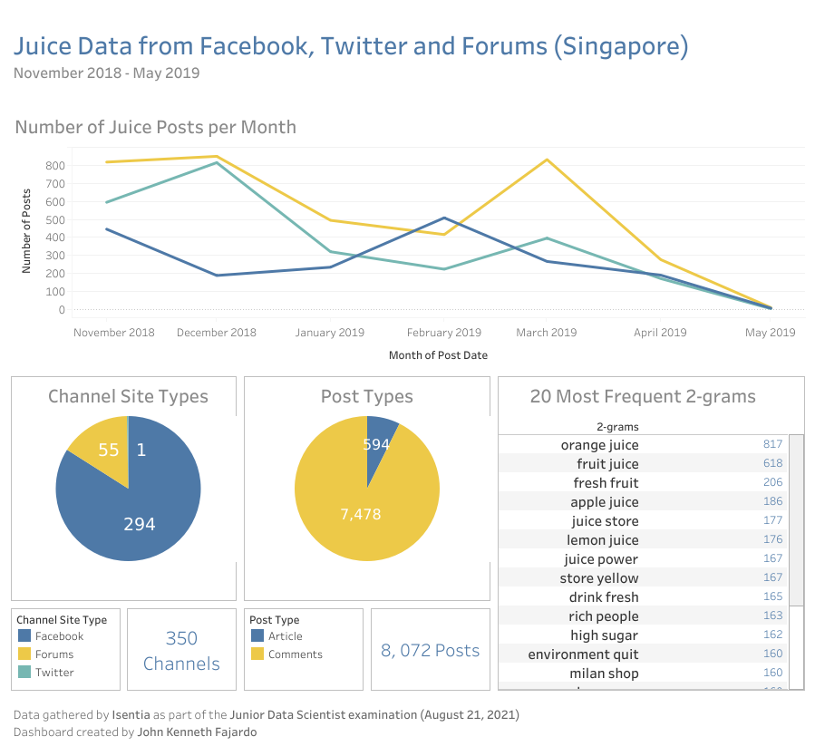

```{r setup, include=FALSE}
knitr::opts_chunk$set(echo = TRUE)
```

## Overview
This documentation presents how text analyses and natural language processing have been used to gather insights for what we would call "Juice Dataset". This is a technical assessment for the Junior Data Scientist Job at Isentia.

## Business Problem
Observing the raw data, we can infer that the content comes from personal posts that contain the word “juice”. The word is used differently as it relates to  beverages, creativity, and even batteries. In order to gather insights, we will be doing **topic modeling**, and look for the **top n-grams** to learn what people think about when they mention “juice” in their posts.

## Exploratory Analysis
The data has 8,072 documents posted from November 03, 2018 to May 02, 2019 (18 months). The data is gathered from three types of channels: 

(1) Social Networking Sites - Facebook Pages (1,845 obs.) 
(2) Microblogs - Twitter (2,528 obs.) 
(3) Forums (3,699 obs.)

All of the posts were made in the Singaporean region. For visualizations of the data, a dashboard is made available [here](https://public.tableau.com/app/profile/john.kenneth.fajardo/viz/Isentia/Dashboard1), via Tableau Public. A screenshot of the dashboard can be seen below.



## Topic Modeling
The statistical model used for assigning topics is *Latent Dirichlet Allocation* (LDA). With the help of the R library, *Quanteda*, we are able to categorize the following group of keywords to help analysts deduce and choose related topics:

```{r source, echo=FALSE, message=FALSE, cache=TRUE}
source('datamining.R')
```

### Table 1: 10 LDA-generated Topics with Their Respective Associated Terms
```{r topic, echo=FALSE, message=FALSE}
library(seededlda)
library(kableExtra)
kable(terms(ldadata, 10), 'html')  %>% kable_styling()
```

Since the key terms are already grouped for us, we can easily assign topic names for each group. For example, `topic7` can be renamed as "Politics" and `topic8` can be renamed as "Ingredients in Recipes".

### Table 2: Number of Documents Assigned to the Topics
```{r topicfreq, echo=FALSE, message=FALSE}
kable(table(topics(ldadata)), 'html') %>% kable_styling(full_width = F, position='left')
```

The table includes the number of documents classified in the respective topics. For example, 472 documents in the dataset talk about politics.

## Word Frequency
In addition to topic modeling, we can also gather insights from just observing the most frequent words and n-grams.

```{r freq, echo=FALSE}
library(ggplot2)
library(quanteda.textstats)
freqPlot(dfmdata, 'Fig. 1: Top 20 Most Frequent Words')
freqPlot(dfmdata2, 'Fig. 2: Top 20 Most Frequent 2-Grams')
```

We can see different types of juice mentioned, the phrase “rich people” may imply that juice is common among the affluent people, and the phrase “high sugar” may lead to the inclusion of health in the discourse on juices especially store-bought ones, and so on.

## Sentiment Analysis
To observe user activity, particularly if the polarities are either positive or negative based from the word usage in their posts, a polarity-vs-time graph was generated. This would help the analysts pinpoint the dates where the word "juice" became trendy for both good and bad reasons.
```{r sentiment, echo=FALSE, message=FALSE}
plot(dfmatdata_posneg$Date, dfmatdata_posneg[,"positive"] - dfmatdata_posneg[,"negative"], 
     type = "l", ylab = "Sentiment", xlab = "Date", main = "Sentiment of Related Words to \"Juice\" from 2018-11 to 2019-05")
grid()
abline(h = 0, lty = 2)
```

## Conclusion
Before cleaning the sporadic data, looking at the dataset led to multiple, unorganized observations. With the help of topic modeling and document-frequency matrices, we were able to limit and identify topic classifications. A sentiment analysis was also included to illustrate data points where there are significant increases in polarity over time. With these distilled information from a vast load of  information, we help our analysts craft clear-cut conclusions that benefit our clients and the technological world.